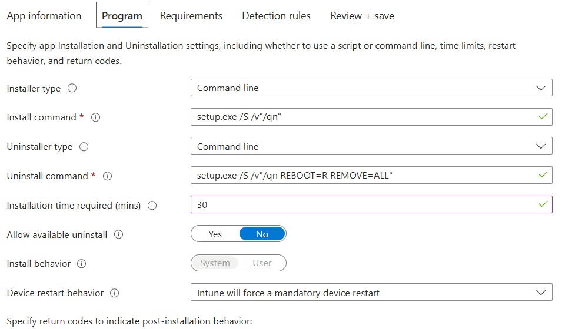
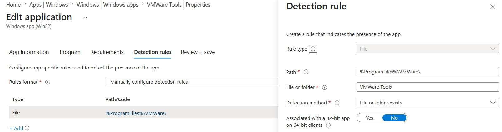

# VM Tools

Install Command
``` cmd
setup.exe /S /v"/qn"
```

Uninstall Command
``` cmd
setup.exe /S /v "/qn msi_args REBOOT=R REMOVE=ALL"
```

Device Restart select:

**Force Manatory reboot**



## Detection

Path: 

``` cmd
%ProgramFiles%\VMWare\
```

File or Folder: 

``` text
VMware Tools
```


## Notes

To install only on VMWware Virtual Machines, you can create a group with dynamic device membership with the rules syntax as:
``` text
(device.deviceManufacturer -eq "VMware, Inc.")
``` 